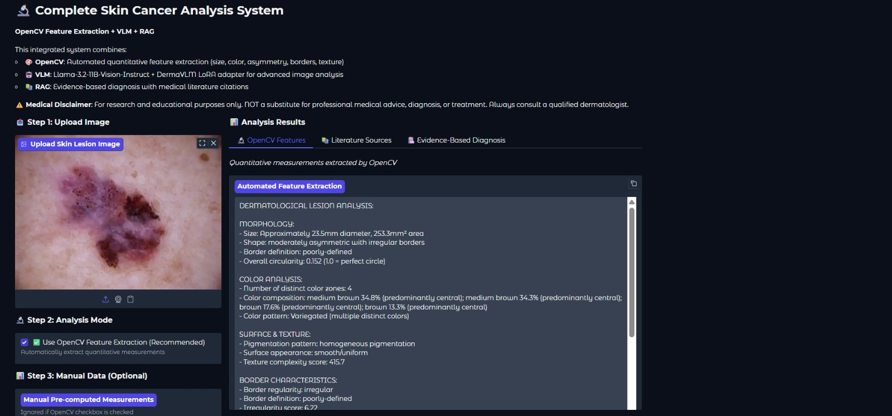
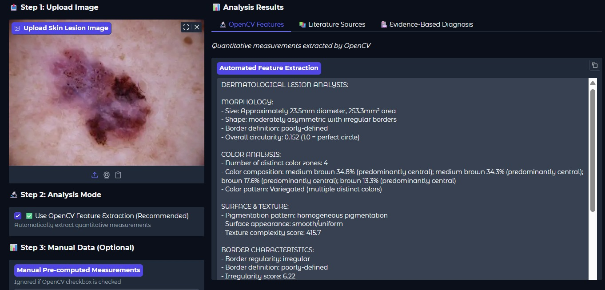
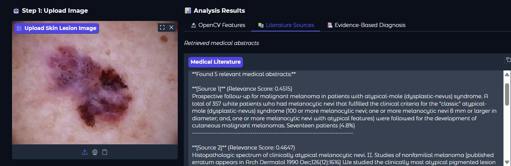
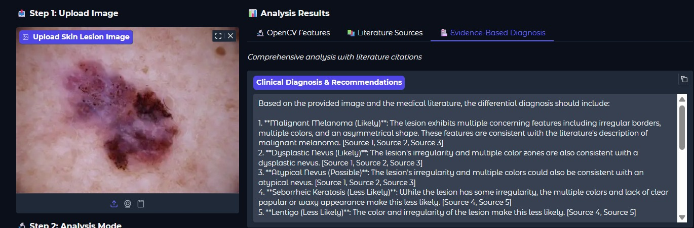

# Multimodal AI Dermatological Diagnosis System

[](https://opensource.org/licenses/MIT)
[](https://www.python.org/downloads/)
[](https://colab.research.google.com/)

A comprehensive AI-powered skin lesion analysis system that combines **OpenCV feature extraction**, **Vision Language Models (VLM)**, and **Retrieval-Augmented Generation (RAG)** to provide evidence-based dermatological diagnoses with medical literature citations.



## Key Features

### Triple-Modality Analysis
- **OpenCV Computer Vision**: Automated quantitative feature extraction
- **Vision Language Model**: Llama-3.2-11B-Vision-Instruct with DermaVLM LoRA adapter
- **RAG System**: Medical literature retrieval and citation from 4,000+ dermatology abstracts

### Comprehensive Analysis Output
- **5+ Ranked Differential Diagnoses** with likelihood levels
- **Quantitative Measurements**: Size, asymmetry, color distribution, border irregularity
- **ABCDE Melanoma Risk Assessment**: Automated detection of risk factors
- **Evidence-Based Recommendations**: With medical literature citations
- **Patient Communication Guidance**: Clear, compassionate explanations

### Advanced Image Processing
- Automated hair artifact removal
- K-means clustering for lesion segmentation
- Multi-color zone detection with spatial distribution
- Border irregularity and texture analysis
- Circularity and asymmetry scoring

## Interface Screenshots

### OpenCV Feature Extraction

*Automated quantitative measurements including size, shape, color distribution, and ABCDE risk factors*

### Medical Literature Sources

*Retrieved relevant medical abstracts with relevance scores*

### Evidence-Based Diagnosis

*Comprehensive clinical analysis with literature citations and recommendations*

## Quick Start

### Prerequisites
- Google Colab account (recommended) or local Jupyter environment
- HuggingFace account with access to Llama-3.2-11B-Vision-Instruct
- GPU runtime (T4 or better recommended)

### Installation

1. **Clone the repository**
```bash
git clone https://github.com/Malek-logh/Multimodal-AI-Dermatological-Diagnosis-System.git
cd Multimodal-AI-Dermatological-Diagnosis-System
```

2. **Open in Google Colab**
- Upload `dermatology_diagnosis_system.ipynb` to Google Colab
- Select GPU runtime: `Runtime → Change runtime type → GPU (T4)`

3. **Run Setup Cells**
Execute cells sequentially:
- **Cell 1**: Install all dependencies
- **Cell 2**: HuggingFace authentication
- **Cell 3**: Build RAG system with medical literature
- **Cell 4**: Load VLM model
- **Cell 5**: Setup OpenCV pipeline
- **Cell 6**: Launch Gradio interface

### Usage

1. **Upload Image**: PNG/JPG dermoscopic or clinical image
2. **Select Analysis Mode**:
   -  **OpenCV Enabled** (Recommended): Automated feature extraction
   -  **OpenCV Disabled**: Direct VLM analysis or manual measurements
3. **Adjust Parameters** (Optional):
   - Analysis tokens (512-2048)
   - Temperature (0.1-1.0)
   - Number of sources (1-10)
4. **Click "Analyze Lesion"**
5. **Review Results** across three tabs:
   - OpenCV Features
   - Literature Sources
   - Evidence-Based Diagnosis

## System Architecture

```
Input Image
    ↓
┌─────────────────────────────────┐
│   OpenCV Feature Extraction     │
│  • Hair removal                 │
│  • Lesion segmentation          │
│  • Quantitative measurements    │
└─────────────────────────────────┘
    ↓
┌─────────────────────────────────┐
│      RAG Medical Retrieval      │
│  • FAISS vector search          │
│  • 4,000+ medical abstracts     │
│  • Top-K relevance ranking      │
└─────────────────────────────────┘
    ↓
┌─────────────────────────────────┐
│   Vision Language Model (VLM)   │
│  • Llama-3.2-11B-Vision         │
│  • DermaVLM LoRA adapter        │
│  • Multi-modal fusion           │
└─────────────────────────────────┘
    ↓
Evidence-Based Diagnosis Report
```

## Technical Details

### Models & Libraries
- **VLM**: meta-llama/Llama-3.2-11B-Vision-Instruct (4-bit quantized)
- **LoRA Adapter**: DermaVLM/DermatoLLama-50k
- **Embeddings**: sentence-transformers/all-MiniLM-L6-v2
- **Vector Store**: FAISS
- **Computer Vision**: OpenCV, scikit-image
- **Framework**: Transformers, LangChain, Gradio

### Dataset
- **Medical Abstracts**: TimSchopf/medical_abstracts dataset
- **Filtered Corpus**: 4,009 skin cancer & cardiology abstracts
- **Keywords**: melanoma, basal cell carcinoma, squamous cell carcinoma, dysplastic nevus, dermatoscopy, ABCDE criteria, etc.

### OpenCV Feature Extraction
- **Morphology**: Area, perimeter, diameter, circularity, asymmetry score
- **Color Analysis**: K-means clustering (4+ color zones), RGB→CSS3 name mapping, dermatological color classification
- **Spatial Distribution**: Central vs peripheral color patterns
- **Border Assessment**: Irregularity score, definition quality, notching detection
- **Texture**: Variance analysis, edge density, pigmentation patterns
- **ABCDE Risk**: Automated melanoma risk factor detection

### Computational Requirements
- **RAM**: 16GB minimum (Colab free tier sufficient)
- **GPU**: T4 or better (provided by Colab)
- **Storage**: ~30GB for model weights + datasets
- **Runtime**: ~10 minutes setup, ~30-60 seconds per analysis

## Output Structure

### 1. OpenCV Features Tab
```
DERMATOLOGICAL LESION ANALYSIS:

MORPHOLOGY:
- Size: Approximately X.X mm diameter, X.X mm² area
- Shape: [asymmetric/symmetric] with [regular/irregular] borders
- Border definition: [well-defined/poorly-defined]
- Overall circularity: X.XXX

COLOR ANALYSIS:
- Number of distinct color zones: X
- Color composition: [detailed breakdown with percentages]
- Spatial distribution: [central/peripheral/mixed]

SURFACE & TEXTURE:
- Pigmentation pattern: [reticular/irregular/homogeneous]
- Surface appearance: [smooth/textured/varied]

ABCDE RISK FACTORS:
⚠️ [Detected risk factors or "No major risk factors"]
```

### 2. Literature Sources Tab
- Relevance-ranked medical abstracts
- Similarity scores
- Source indexing for citations

### 3. Evidence-Based Diagnosis Tab
```
1. DIFFERENTIAL DIAGNOSIS (Ranked by Likelihood)
   - [5+ diagnoses with likelihood levels]
   - Citations: [Source X], [Source Y]

2. CONCERNING FEATURES WITH EVIDENCE
   - [Specific quantitative features]
   - Clinical significance with citations

3. COMPARISON TO LITERATURE PATTERNS
   - [Statistical context from sources]

4. CLINICAL RECOMMENDATIONS
   - Urgency level: [Immediate/Urgent/Routine]
   - Next steps: [Specific actions]
   - Follow-up timeline
   - Citations: [Source X]

5. PATIENT COMMUNICATION GUIDANCE
   - [Clear, compassionate explanation]
```

## Medical Disclaimer

**This system is for research and educational purposes only.**

- NOT a substitute for professional medical advice, diagnosis, or treatment
- NOT FDA approved or clinically validated
- Always consult a qualified dermatologist for medical decisions
- Do not use for self-diagnosis or treatment planning
- Intended for research, education, and tool development

## Contributing

Contributions are welcome! Please:
1. Fork the repository
2. Create a feature branch (`git checkout -b feature/AmazingFeature`)
3. Commit your changes (`git commit -m 'Add AmazingFeature'`)
4. Push to the branch (`git push origin feature/AmazingFeature`)
5. Open a Pull Request

## Acknowledgments

- **Meta AI** for Llama-3.2-11B-Vision-Instruct
- **DermaVLM Team** for the DermatoLLama-50k adapter
- **Timothy Schopf** for the medical_abstracts dataset
- **Hugging Face** for model hosting and transformers library
- **Gradio** for the interactive interface framework

## Contact

For questions, issues, or collaboration:
- Open an issue on GitHub
- Email: [loghmarimalek@hotmail.com]

**If you find this project useful, please consider giving it a star!**
